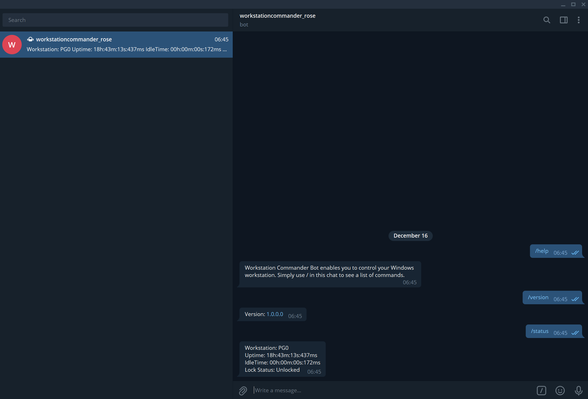

[](https://twitter.com/morrisonbrett)

# Workstation Commander

## 🌈 Overview

Workstation Commander allows you to interact with your Windows Workstation via a Telegram Bot.

The main technology stack platform is [.NET Core](https://dotnet.microsoft.com/) 6.0.



## 🛠 Prerequisites

* Install Visual Studio 2022 (preview) or later, or Visual Studio Code. Ensure that `$ dotnet --version` is at least 6.0.

## ⌨️ Configure and Build

Create a Telegram Bot Token from [Telegram Bot Token Creation](https://core.telegram.org/bots#6-botfather).

Create a new file at the root of WorkstationCommander.TelegramBot named `appsettings.json` and add the following, replacing the word "value" below with your token.

```json
{
  "TelegramBotKey": "value"
}
```

```bash
$ dotnet restore
$ dotnet build
$ dotnet run
```
Or, open the WorkstationCommander.TelegramBot.sln solution in Visual Studio, and build and run the solution from there.

Once confirmed working, create a Task to startup at system boot or login in [Task Scheduler](https://www.howtogeek.com/tips/how-to-run-a-scheduled-task-without-a-command-window-appearing/).


## ❤️ Contributing

We welcome all contributions. Please read our [contributing guidelines](CONTRIBUTING.md) before submitting a pull request.

## 📜 License

Workstation Commander is licensed under the MIT license.

[](LICENSE)
